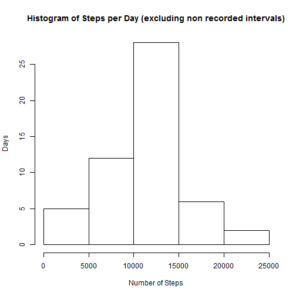
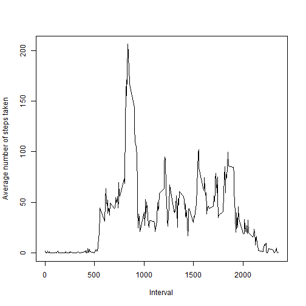
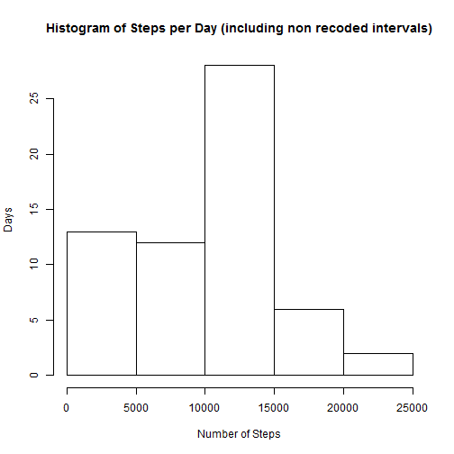
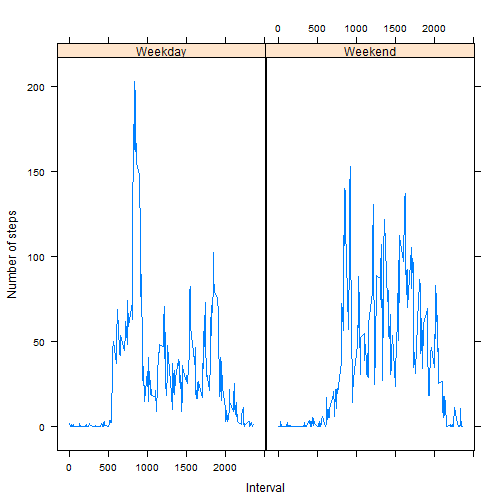

Reproducible Research Assignment 1
========================================================

This assignment makes use of data from a personal activity monitoring device. This device collects data at 5 minute intervals through out the day. The data consists of two months of data from an anonymous individual collected during the months of October and November, 2012 and include the number of steps taken in 5 minute intervals each day.

Read data file "activity.csv"
--------------------------------------------------------


```r
activity <- read.csv("activity.csv") #Assuming that file is present in working directory
head(activity)
```

```
##   steps       date interval
## 1    NA 2012-10-01        0
## 2    NA 2012-10-01        5
## 3    NA 2012-10-01       10
## 4    NA 2012-10-01       15
## 5    NA 2012-10-01       20
## 6    NA 2012-10-01       25
```

## What is mean total number of steps taken per day?


```r
stepsPerDay<-by(activity$steps,activity$date,sum) 
meanStepsPerDay<-mean(stepsPerDay,na.rm=TRUE) #In this case we will simply ignore NA i.e. remove the intervals where steps are not recorded.
medianStepsPerDay<-median(stepsPerDay,na.rm=TRUE) #In this case we will simply ignore NA i.e. remove the intervals where steps are not recorded.
hist(stepsPerDay,main="Histogram of Steps per Day (excluding non recorded intervals)" , xlab="Number of Steps",ylab="Days")
```

 

***Average steps per day is 10766.19 and median steps per day is 10765.00***

## What is the average daily activity pattern?


```r
meanStepsPerInterval <- aggregate(activity$steps,by=list(activity$interval),FUN=mean,na.rm=TRUE) #Calculate Average step for each interval
colnames(meanStepsPerInterval) <-c("intervals","Average_Steps") #Set Appropriate names to the aggregated data frame 
plot(meanStepsPerInterval$intervals,meanStepsPerInterval$Average_Steps,type="l",xlab="Interval",ylab="Average number of steps taken")
```

 

```r
maxStepsPerInterval <-max(meanStepsPerInterval$Average_Steps)
intervalWithMaxSteps<-which(max(meanStepsPerInterval$Average_Steps)==meanStepsPerInterval$Average_Steps)
```

***Interval 104 has the maximum average 206.17  daily steps taken on each day.***


## Imputing the missing values


```r
IntervalsWithNA <- activity[!complete.cases(activity[,c("steps")]),] #Find out all intervals for all days where activity was not recorded.
TotalIntervalsWithNA <- nrow(IntervalsWithNA)  #Total number of intervals in data set where steps are recorded as NA
activityNAasZero <- activity                   #Create new dataframe from existing dataframe
activityNAasZero$steps[is.na(activityNAasZero$steps)]<-0 #Replace all the NA with zero in new data frame

stepsPerDayNA<-by(activityNAasZero$steps,activityNAasZero$date,sum) #Calculating steps taken per day with replacing 0 for NA 
meanStepsPerDayNA<-mean(stepsPerDayNA) # Including intervals where steps are not recorded.
medianStepsPerDayNA<-median(stepsPerDayNA) #Including intervals where steps are not recorded.
hist(stepsPerDayNA,main="Histogram of Steps per Day (including non recoded intervals)" , xlab="Number of Steps",ylab="Days")
```

 

***Total number of missing values in the dataset is 2304***

***Average steps per day ignoring non recorded interval is 10766.19 and included non recording intervals is 9354.23***

***Median steps per day ignoring non recorded interval is 10765.00 and included non recording intervals is 10395.00***

We can conclude that mean and median comes down when we replace NA with zero for non recorded intervals.

## Are there differences in activity patterns between weekdays and weekends?


```r
#install.packages("lattice")
library(lattice)
```

```
## Warning: package 'lattice' was built under R version 3.0.3
```

```r
activityNAasZero$week_level <-sapply(weekdays(as.Date(activityNAasZero$date),abbreviate=TRUE),switch,Mon="Weekday",Tue="Weekday",Wed="Weekday",Thu="Weekday",Fri="Weekday",Sat="Weekend",Sun="Weekend") # This will add day_level column to the data frame identifying whether date is weekday or weekend
meanStepsPerInterval_PerWeekLevel <- aggregate(activityNAasZero$steps,by=list(activityNAasZero$interval,activityNAasZero$week_level),FUN=mean) #Calculate average 
colnames(meanStepsPerInterval_PerWeekLevel) <-c("intervals","Week_Level","Average_Steps")
xyplot(Average_Steps~intervals|Week_Level,data=meanStepsPerInterval_PerWeekLevel,type="l",xlab="Interval",ylab="Number of steps")
```

 

